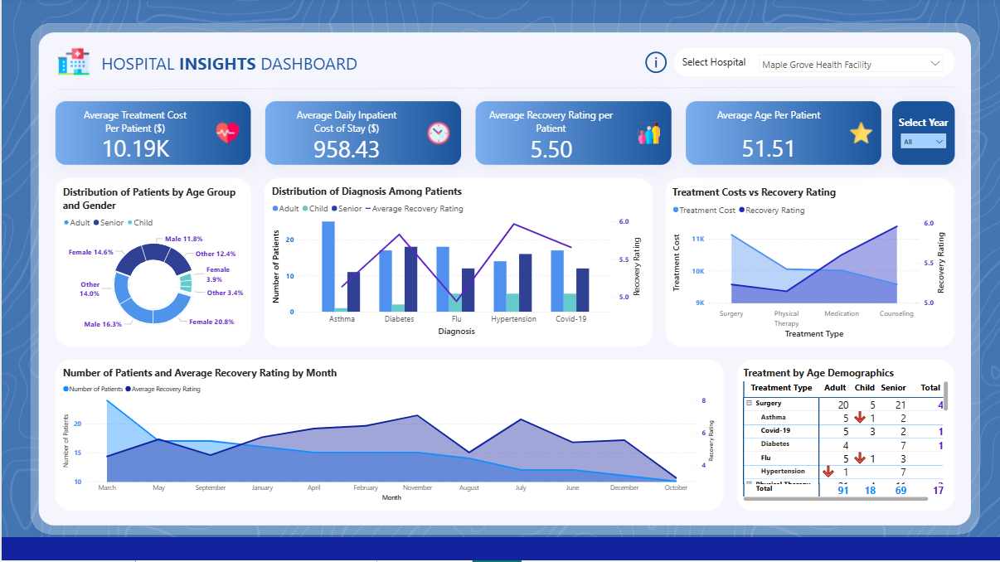

# 🏥 Hospital Insights Dashboard

A Power BI analytics dashboard that visualizes **patient demographics, treatment outcomes, and cost efficiency** using sample hospital data.

---

## 📊 Overview
This project demonstrates how healthcare data can be analyzed to uncover:
- **Treatment outcomes vs. costs** – identify cost-effective treatments.
- **Age-group recovery insights** – understand recovery trends by age.
- **Monthly admission trends** – track and forecast hospital resource demand.

Built for showcasing **data visualization, DAX measures, and Power Query** skills.

---

## 🗂 Project Structure

Hospital-Insights-Dashboard/
│
├─ Hospital Insights Dashboard.pbix        # Power BI dashboard
├─ Hospital Insights Dashboard.png         # Screenshot preview
├─ data/
│   ├─ patients.xlsx                       # Sample patient data (mock)
│   └─ hospitals.xlsx                      # Sample hospital data (mock)
└─ README.md                               # Documentation

---

## 🚀 Getting Started

1. **Clone or Download** this repository.
2. Open `Hospital Insights Dashboard.pbix` in **Power BI Desktop**.
3. Connect to included Excel files in the `data/` folder (already pre-linked for the sample dataset).
4. Refresh to explore interactive visuals.

---

## 🧰 Tools & Technologies
- **Power BI Desktop** – dashboard & DAX calculations  
- **Excel** – sample datasets  
- **DAX / Power Query** – data modeling & transformations  

---

## ✨ Key Features
- Dynamic visuals comparing **treatment outcomes vs. costs**  
- Interactive slicers for **age groups & treatments**  
- Monthly admission trend analysis for resource planning  

---

## 📷 Preview

---
